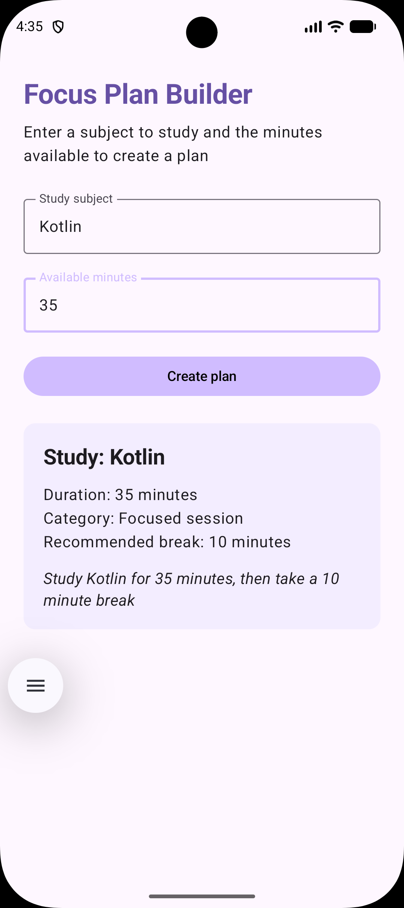

## Assignment 2: Focus Plan Builder
**Name:** Namratha Reddy  
**BU ID:** U65966062  
**Course:** CS-501 E1

### Description:
Focus Plan Builder is a single screen Android application built using Kotlin, Jetpack Compose and Material 3. It allows users to enter a subject to study and the available minutes they have to create a study plan. The app then validates the input and generates a focus plan with the study duration, session category, recommended break and a short summary

### How to Run:
1. Clone or download this repository
2. Open Android Studio and open the project
3. Allow Gradle to sync
4. Start the Android emulator or connect an Android device
5. Run the app by clicking the Run button

### Screenshot:

### State and Recomposition:
FocusPlanRoute owns the application state, including the subject, minutes text and the generated FocusPlan. The text fields store their values as String because users may temporarily leave a field empty or enter incomplete or invalid input. Storing the minutes directly as an Int would make it harder to represent those intermediate inputs.
The app uses toIntOrNull() to convert the minutes text into an integer, unlike toInt(), which throws an exception for invalid input, toIntOrNull() returns null which allows the app to disable the Create plan button safely.
When the user changes either of the input fields, its state updates, composes then recomposes the affected UI, recalculating canCreatePlan and updating whether the Create plan button is enabled. Editing either field also clears the previously generated plan.
rememberSaveable preserves the subject and minutes text across configuration changes, for example, screen rotation. A local variable would be reset during recomposition and remember wouldn't preserve the inputs when the Activity is recreated. The generated plan uses remember as rememberSaveable alone won't work to preserve the state after rotation

### Collaboration and Generative-AI Disclosure:
I didn’t collaborate with anyone for this assignment. I used Gemini 3.6 Flash. I
asked for explanations of the assignment requirements, "why should a text field
store numeric input as a string instead of int", "how can I separate state
management from the ui by using a focusplanroute composable and focusplanscreen
composable", "how can I clear a previous study plan when the user changes either
input fields" and I asked questions on concepts like, “why is the state not preserving
for my study plan even after using rememberSaveable” Also, I asked questions regarding
the Kotlin syntax
#### -Relevant suggestions produced:
Gemini suggested splitting the app into two composables and explained what each should
do, like FocusPlanRoute manages the input state, validates the duration, creates the
study plan and then clears outdated results. FocusPlanScreen receives the values and
callbacks as parameters and displays the UI. It also showed me how to connect them so
the screen updates when the state changes

#### -What I accepted, changed, or rejected:
I asked why rememberSaveable wasn't preserving the plan state and it said it can preserve
values like String and Int but since FocusPlan is a custom data class that Android can't
automatically save, to preserve the generated plan after rotation, I would need to make
it saveable using a custom Saver or Parcelable. I chose not to go with this implementation
because preserving the generated plan after rotation was optional and felt out of scope,
so I focused on only preserving the user’s inputs with rememberSaveable

#### -Verification:
I verified my work by building and running the project in Android Studio on a Pixel 9
API 24 emulator. I manually tested the required input casesblank subject, empty or
non-numeric duration and durations outside the 10-180 minute range to confirm the Create
Plan button remained disabled. I also tested the boundary values (10, 29, 30, 60, 61, and 
180 minutes) to check that the session categories and recommended breaks were correct.
I also changed the inputs after generating a plan to confirm the previous result disappeared.
Finally, I rotated the emulator to check which values were preserved and confirmed that the
text fields retained their inputs but the generated plan reset. I also checked that the
screen remained scrollable in landscape mode
